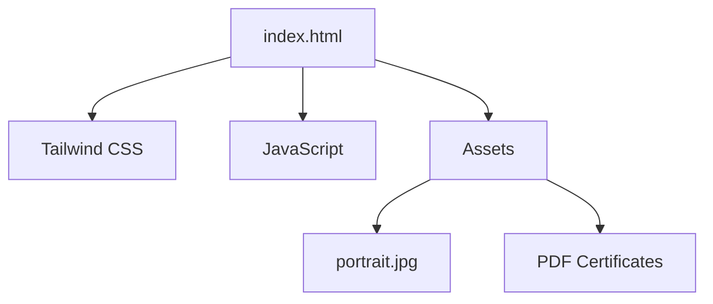

# Waiting's Portfolio

這是一個使用 Tailwind CSS 和 JavaScript 建立的個人作品集網站。

## 系統架構

## 安裝與執行

由於本專案僅包含靜態檔案，您可以直接使用瀏覽器開啟 `index.html` 或是使用簡易的 HTTP Server (如 Live Server) 進行開發與測試。

## API 規格

本專案目前無外部 API 調用。

## 注意事項
- PDF 預覽功能依賴於 iframe，請確保 PDF 檔案路徑正確。
- 使用 Tailwind CSS CDN 進行原型開發。
